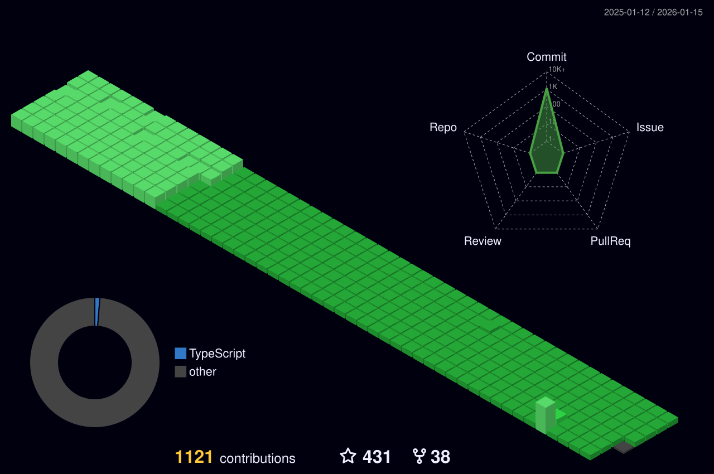

<h1 align="center">Hello Fellow < Developers/ ></h1>
<h3 align="center"> I'm NISRIN — an aspiring developer passionate about learning and building cool things!</h3>

<!-- - 🌱 I’m currently exploring and improving my skills in **Python, Django, C/C++**, and **React**  

- 👯 I’m especially excited about growing as a **Python developer** and collaborating on projects  

- 💬 Ask me about **Python, Django, FastAPI, React**	 -->
I love the collaborative and open‑source nature of the developer community, and I’m excited to share my journey and projects here on GitHub.  
My goal is to keep learning, build real‑world projects, and contribute to and learn from amazing people and open‑source communities.

<!-- Feel free to explore my repositories and connect with me — I’m always open to new opportunities and collaborations! -->
New to Python and web dev but super excited about building things with Django, FastAPI, and React!  
Always happy to learn from others — let’s collaborate!
  

<h3 align="left">Favorite quote:</h3>

“I always did something I was a little not ready to do. I think that’s how you grow. When there’s that moment of ‘Wow, I’m not really sure I can do this,’ and you push through those moments, that’s when you have a breakthrough.” – Marissa Mayer

“It does not matter how slowly you go as long as you do not stop.” – Confucius

<h3 align="left">Connect with me:</h3>

<h3 align="left">Languages and Tools:</h3>

  
  
  
  
  
  
  
  
  
  
  
  
  
  

# Contributions
(in the last 365 days, languages pie based on number of commits)

 
<h3 align="center">
	⬇ Check my pinned projects below and leave a ⭐️ ⬇
</h3>

